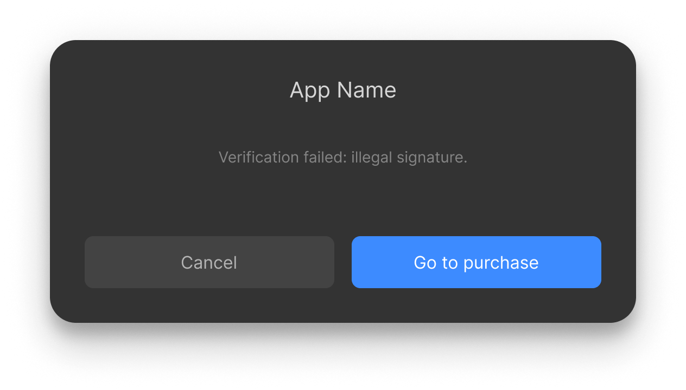

# Unity project setup

When building the application and running the APK file on the headset initially was met with:

Ensure the application name differs from the default and set up key store, this fixed the verification problem.

# Enabling passthroguh in PICO 4

Follow the guide on https://developer.picoxr.com/document/unity/seethrough/
